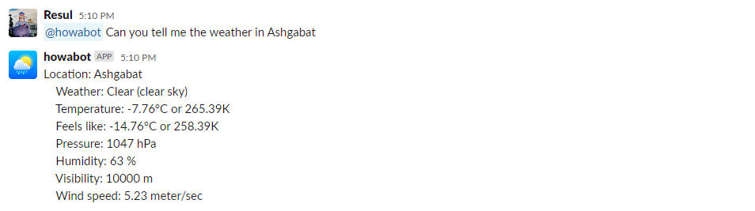

# Howabot
**Howabot** is a slack bot which tells weather in any location in the World🌍

---
## How to set up bot?
>You need create `config.json` file where we will store our env variables (as shown in `config-sample.json`)

Howabot uses [OpenWeather](https://openweathermap.org/) API for getting weather information. So you will need add API key to access it. To get that, sing up to https://openweathermap.org and go to `My API keys` in your profile. Then copy your API key and paste it as value of `"open_weather_api_key"` in `config.json`

For creating Slack bot we used a [Slacker](https://github.com/shomali11/slacker) freamework which is built on top of the Slack API https://github.com/slack-go/slack. To get started, you must have or create a [Slack App](https://api.slack.com/apps?new_app=1) and enable `Socket Mode`, which will generate your app token (`"slack_app_token"` in the `config.json`) that will be needed to authenticate. 
